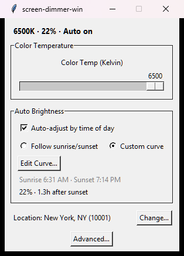
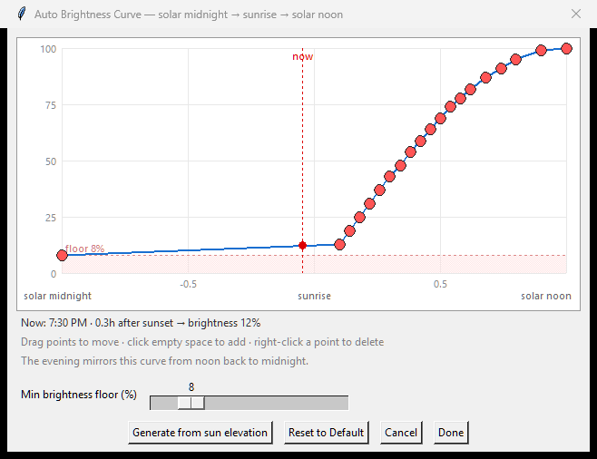

# screen-dimmer-win

A single-file Windows tray app that dims your screen below the hardware minimum,
tints it warm at night, and can follow the sun with an auto-brightness curve you
draw yourself.

It works by rewriting the display's **gamma ramp**, so it can go much dimmer than
the monitor's own backlight control, and it repairs the ramp if another app or a
display event resets it.



## Features

- **Brightness 5–100 %** via a gamma-ramp LUT — dimmer than the monitor OSD allows.
- **Colour temperature 1000–6500 K** (6500 K = untouched screen).
- **Per-channel RGB balance** for arbitrary tints.
- **Auto brightness**, two schedules:
  - *Follow sunrise/sunset* — computed from your location with 30-minute fades and
    a configurable night level.
  - *Custom curve* — a 24-hour curve on a sun-anchored axis, with a minimum-brightness
    floor and a one-click "generate from sun elevation" curve.
- **Location from a US zip code** (geocoding + timezone lookup); without a location
  it falls back to a fixed 07:00–19:00 schedule.
- **Settings persist** to `settings.json` next to the script.
- **Minimize to tray** (optional; requires `pystray` + `Pillow`).
- **Watchdog + event-driven repair** — Windows has no gamma-change notification, so a
  2 s poll runs alongside hooks for foreground changes and display/device events,
  which re-apply the ramp immediately when a game or a mode switch stomps it.
- **Always resets the screen** to an identity ramp on exit.

## Requirements

- Windows 10/11
- Python 3.12+
- [`uv`](https://docs.astral.sh/uv/) (recommended) or `pip`
- **HDR off** — gamma ramps are ignored in HDR mode

## Install and run

### With uv

```powershell
git clone https://github.com/jansenmtan/screen-dimmer-win.git
cd screen-dimmer-win
uv run screen-dimmer-win.py    # or: .\run.ps1
```

### With plain Python

```powershell
py -3.12 -m venv .venv
.\.venv\Scripts\pip install -r requirements.txt
.\.venv\Scripts\python screen-dimmer-win.py
```

### Start automatically at login

`autostart.vbs` launches the app through `.venv\Scripts\pythonw.exe`, so there is no
console window. Put a shortcut to it in `shell:startup`
(<kbd>Win</kbd>+<kbd>R</kbd> → `shell:startup`).

## Using it

The header line always shows the live state: colour temperature or RGB, current
brightness, and whether auto is on.

| Control | What it does |
|---|---|
| **Color Temp (Kelvin)** | Warmer as you slide left; 6500 K is a no-op. |
| **Brightness (%)** | Manual dimming. Hidden while auto brightness is on, so nothing on screen contradicts the level in use. |
| **Auto-adjust by time of day** | Enables the schedule; the sub-controls appear underneath and auto takes over the brightness level. |
| **Night Brightness** | Floor level for the sunrise/sunset schedule. |
| **Edit Curve…** | Opens the curve editor (custom-curve mode only). |
| **Advanced…** | Colour mode switch, minimize-to-tray toggle, and *Reset Screen to Normal*. |
| **Change…** (location) | Enter a US zip code to set lat/lon + timezone. |

### The curve editor



The curve is drawn on a **normalized, sun-anchored axis**: `x = -1` is solar
midnight, `x = 0` is sunrise, `x = 1` is solar noon. Because mornings and evenings
differ in length by season and latitude, each half-day is normalized to its own
duration and the evening is the mirror of the morning — so the curve stays correct
all year without editing it.

- Drag a point to move it, click empty space to add one, right-click a point to delete.
- **Min brightness floor** clamps the whole curve from below (0–50 %).
- **Generate from sun elevation** builds a clear-sky irradiance curve for your location.
- The vertical marker shows where "now" sits on the curve.

## Troubleshooting

### Fullscreen content looks brighter / washed out (G-SYNC and VRR)

If fullscreen games look brighter than the same app windowed, the likely cause is
your monitor's variable refresh rate, **not** this app — it reproduces with the
dimmer fully quit and an identity gamma ramp.

Verified on an ASUS ROG Swift OLED PG27AQWP-W (540 Hz WOLED), NVIDIA GTX 1660,
Windows 11 build 26200, HDR off:

| Test | Result |
|---|---|
| G-SYNC on, fullscreen vs windowed | brighter fullscreen; flicker during play in one app |
| G-SYNC off | brightness difference gone |
| G-SYNC back on | brighter fullscreen returned |
| G-SYNC **off**, identical borderless dark grey, monitor-verified 120 Hz vs 540 Hz | noticeably **brighter at 120 Hz**, darker at 540 Hz |
| Gamma ramp readback across the transitions | unchanged — the LUT is not reset or bypassed |

So the same pixels at the same gamma ramp are displayed at different brightness
depending only on the panel's refresh rate: OLED gamma is calibrated for a
particular refresh rate, and with G-SYNC on the refresh rate follows the app's
frame delivery. **No fix belongs in this app.**

**Workaround:** disable G-SYNC / Adaptive-Sync (NVIDIA Control Panel → *Set up
G-SYNC*) and run a fixed refresh rate. If you test this yourself, verify the
actual refresh rate **with the monitor's OSD**, not Windows — a fullscreen app can
request its own display mode and silently invalidate the comparison.

### The screen is still dim after the app crashed

Gamma ramps are volatile, so a hard crash can leave a dim screen. Run the app again
and press **Reset Screen to Normal** in *Advanced…*, or log out and back in.

### A fullscreen game overrides the dimming

Exclusive-fullscreen apps can write their own ramp. The watchdog restores yours
within ~2 s, and the foreground/display hooks usually catch it instantly. If a game
fights the app, run it borderless-windowed or in SDR.

### Auto brightness sits at 100 % at night

The sunrise/sunset schedule needs a location. Without one it falls back to a fixed
07:00–19:00 day, which may not match your evening. Set your zip code, or switch to
custom-curve mode and lower the curve.

## Known limitations

- **HDR must be off.** Gamma ramps have no effect on HDR output.
- **Written to the desktop DC** (`GetDC(NULL)`), not to a specific monitor handle, so
  per-monitor control on mixed-GPU setups is not supported.
- **Windows only**, and it runs from source — there is no installer or signed binary.
- **Gamma ramps are volatile.** They are lost on driver restart or reboot, which is
  why the app re-applies them on a timer and after display events.
- Some drivers quantize the 8-bit LUT on read-back; the watchdog uses a tolerance so
  this does not trigger spurious repairs.

## How it works

- `SetDeviceGammaRamp` on a 256-entry LUT applies brightness and per-channel
  multipliers; colour temperature uses the Tanner Helland Kelvin → RGB approximation,
  normalized so 6500 K is exactly the identity ramp.
- Sun times come from [Astral](https://github.com/sffjunkie/astral); the timezone is
  resolved with [timezonefinder](https://github.com/jannikmi/timezonefinder); zip
  codes are geocoded through [Zippopotam.us](https://api.zippopotam.us).
- A watchdog thread polls the hardware ramp every 2 s, while a hidden Win32 window
  plus a `SetWinEventHook` foreground hook catch `WM_DISPLAYCHANGE`,
  `WM_SETTINGCHANGE` and `WM_DEVICECHANGE`, triggering an immediate check followed by
  short re-checks (15–1200 ms).
- The tray icon uses [pystray](https://github.com/moses-palmer/pystray) + Pillow, and
  is optional at runtime.

## Project layout

```
screen-dimmer-win.py    the entire app (GUI, gamma, sun/curve math, watchdog, tray)
autostart.vbs           console-free launcher for login startup
run.ps1                 uv launcher
pyproject.toml          project metadata + dependencies (uv)
requirements.txt        same dependencies for plain pip
uv.lock                 locked dependency versions
docs/screenshots/       images used by this README
settings.json           created at runtime (gitignored)
gamma_watchdog.log      runtime log (gitignored)
```

## Credits

- Kelvin → RGB: Tanner Helland's approximation.
- Sun position and daylight: [Astral](https://github.com/sffjunkie/astral).
- Timezone lookup: [timezonefinder](https://github.com/jannikmi/timezonefinder).
- Zip-code geocoding: [Zippopotam.us](https://api.zippopotam.us).
- Tray icon: [pystray](https://github.com/moses-palmer/pystray) and
  [Pillow](https://python-pillow.org/).

## License

[MIT](LICENSE) © 2026 Jansen Tan
